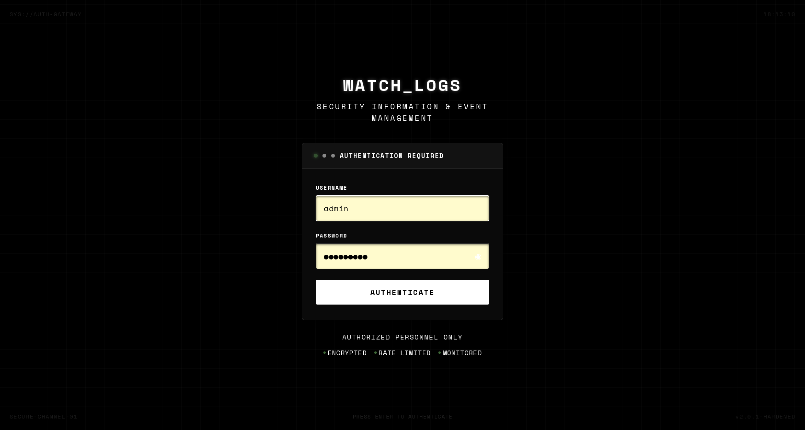
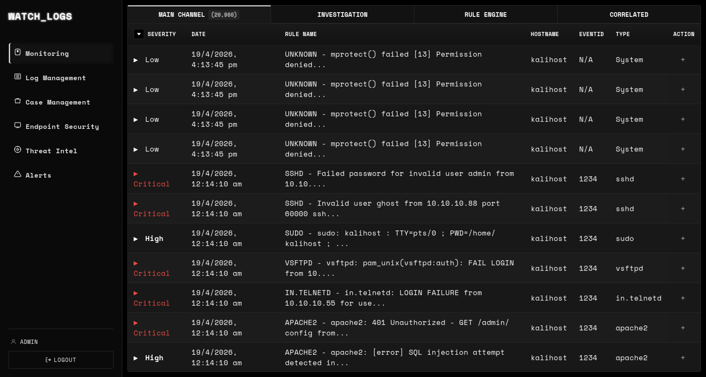
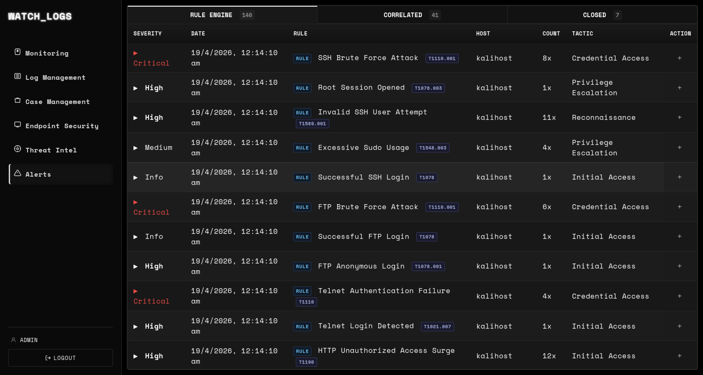
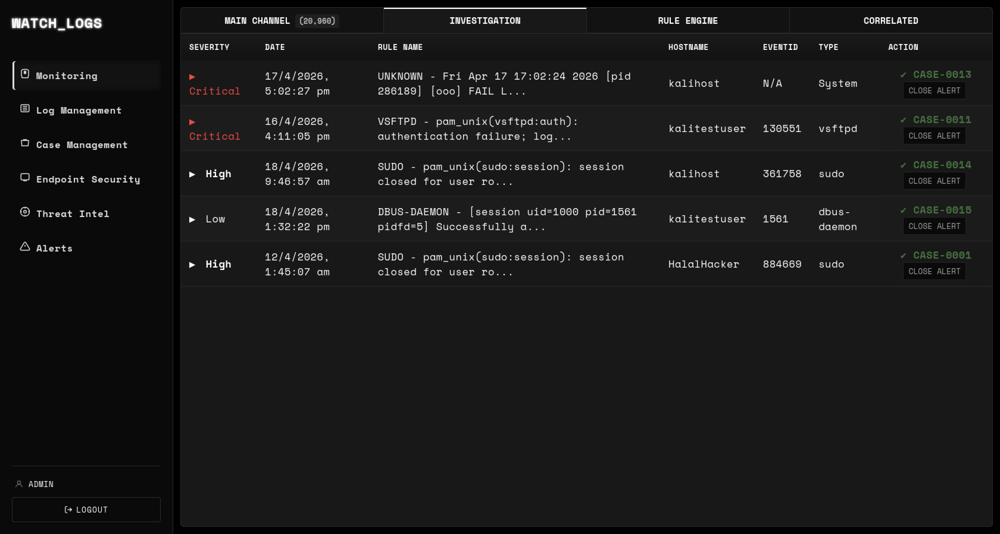
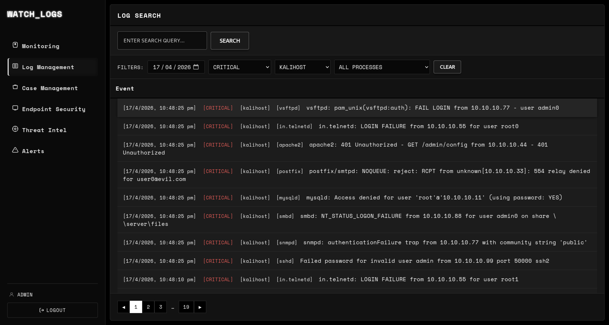
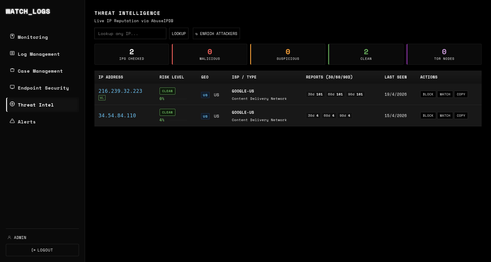

# 🛡️ WATCH_LOGS — Self-Hosted SIEM Dashboard

> A fully-featured, open-source **Security Information and Event Management (SIEM)** platform built on Python + Elasticsearch. Detects real-time threats, correlates multi-event attack chains, scores endpoint risk, isolates compromised hosts, and sends email alerts — all through a clean browser-based dashboard.

---

## 📋 Table of Contents

1. [Features](#-features)
2. [System Architecture](#-system-architecture)
3. [Project Structure](#-project-structure)
4. [Prerequisites](#-prerequisites)
5. [Installation & Setup](#-installation--setup)
6. [Elasticsearch Configuration](#-elasticsearch-configuration)
7. [Logstash Pipeline](#-logstash-pipeline)
8. [Filebeat Setup](#-filebeat-setup)
9. [Running the Backend](#-running-the-backend)
10. [Authentication System](#-authentication-system)
11. [Dashboard Overview](#-dashboard-overview)
12. [Detection Rules](#-detection-rules)
13. [Correlation Engine](#-correlation-engine)
14. [Endpoint Risk Scoring](#-endpoint-risk-scoring)
15. [Endpoint Isolation](#-endpoint-isolation)
16. [Threat Intelligence](#-threat-intelligence)
17. [Email Notifications](#-email-notifications)
18. [API Reference](#-api-reference)
19. [Test Log Injector](#-test-log-injector)
20. [Security Notes](#-security-notes)
21. [Contributing](#-contributing)

---

## ✨ Features

| Feature | Description |
|---|---|
| **Real-Time Log Ingestion** | Logs flow via Filebeat → Logstash → Elasticsearch |
| **Rule-Based Alerting** | JSON-defined `threshold` and `match` rules with MITRE ATT&CK mapping |
| **Correlation Engine** | Detects multi-step attack sequences (e.g. brute-force → success → privesc) |
| **Endpoint Risk Scoring** | Quantified per-host risk score (0–100) based on severity, frequency, and cross-host correlation |
| **Endpoint Isolation** | Administratively block compromised hosts from ingesting further logs |
| **Threat Intelligence** | AbuseIPDB IP reputation lookup on demand |
| **Secure Authentication** | JWT-based login, bcrypt-hashed passwords, brute-force lockout |
| **Log Management** | Search, filter by date / severity / hostname / process, paginate |
| **Email Alerts** | Instant email notification on every `critical`-severity event |
| **ECS Support** | Elastic Common Schema (ECS) event fields for structured detection |
| **Hot-Reload Rules** | Reload detection/correlation rules at runtime — no restart needed |

---

## 📸 Screenshots

> **Tip:** Take screenshots while running the dashboard locally and drop them in `docs/screenshots/`. They will render automatically here on GitHub.

| Login Portal | Overview Dashboard |
|---|---|
|  |  |

| Alerts Tab | Monitoring & Endpoint Risk |
|---|---|
|  |  |

| Log Management | Threat Intelligence |
|---|---|
|  |  |

---

## 🏗️ System Architecture

```
   ┌────────────┐     ┌──────────────┐     ┌─────────────────────┐
   │  Host OS   │────▶│   Filebeat   │────▶│      Logstash        │
   │ (syslog,   │     │ (log shipper)│     │ (parse + enrich ECS) │
   │  auth.log) │     └──────────────┘     └──────────┬───────────┘
   └────────────┘                                       │
                                                        ▼
                                            ┌─────────────────────┐
                                            │   Elasticsearch 8.x  │
                                            │   index: siem-logs-* │
                                            └──────────┬───────────┘
                                                        │
                                            ┌───────────▼──────────┐
                                            │   Flask REST API      │
                                            │   (backend/app.py)    │
                                            │                       │
                                            │  ┌─────────────────┐ │
                                            │  │  Rule Engine    │ │
                                            │  │  Correlator     │ │
                                            │  │  Risk Scorer    │ │
                                            │  │  Email Alerts   │ │
                                            │  └─────────────────┘ │
                                            └───────────┬───────────┘
                                                        │ REST / JSON
                                            ┌───────────▼──────────┐
                                            │  Browser Dashboard    │
                                            │  (HTML + CSS + JS)    │
                                            └──────────────────────┘
```

---

## 🗂️ Project Structure

```
watchlogs/
├── backend/
│   ├── app.py                  # Flask REST API — all endpoints, auth, risk engine
│   ├── rule_engine.py          # Threshold & match rule evaluator
│   ├── correlator.py           # Multi-step sequence correlation engine
│   └── users.json              # User store (PBKDF2 hashed passwords)
│
├── frontend/
│   ├── login.html              # Themed login portal
│   ├── ui.html                 # Main SIEM dashboard shell
│   ├── script.js               # All frontend logic (tabs, charts, API calls)
│   └── style.css               # Dashboard stylesheet
│
├── rules/
│   ├── rules.json              # Detection rule definitions
│   └── correlation_rules.json  # Multi-step correlation rule definitions
│
├── conf/
│   ├── filebeat.yml.new        # Filebeat config template (rename to filebeat.yml)
│   └── siem.conf.new           # Logstash pipeline config (rename to siem.conf)
│
├── inject_test_logs.py         # ECS-enriched test log injector (10 services)
├── .gitignore
└── README.md
```

---

## 📦 Prerequisites

| Component | Version | Purpose |
|---|---|---|
| Python | 3.10+ | Backend runtime |
| Elasticsearch | 8.x | Log storage and search |
| Logstash | 8.x | Log parsing pipeline (optional for live data) |
| Filebeat | 8.x | Log shipping from monitored hosts (optional) |
| A modern browser | Any | Dashboard UI |

---

## 🚀 Installation & Setup

### 1. Clone the repository

```bash
git clone https://github.com/YOUR_USERNAME/watchlogs.git
cd watchlogs
```

### 2. Install Python dependencies

```bash
pip install flask flask-cors elasticsearch werkzeug pyjwt requests urllib3
```

Or create a virtual environment first (recommended):

```bash
python3 -m venv venv
source venv/bin/activate
pip install flask flask-cors elasticsearch werkzeug pyjwt requests urllib3
```

---

## 🔍 Elasticsearch Configuration

Elasticsearch must be running and accessible. The backend connects to:

```
https://localhost:9200
User: elastic
Password: (set in app.py — see Security Notes)
```

### Verify Elasticsearch is running

```bash
curl -k -u elastic:YOUR_PASSWORD https://localhost:9200
```

Expected response:
```json
{ "name": "...", "cluster_name": "...", "version": { "number": "8.x.x" }, ... }
```

### Index pattern

All logs are stored under the wildcard index pattern: `siem-logs-*`

Each day's index is automatically named: `siem-logs-YYYY.MM.DD`

---

## ⚙️ Logstash Pipeline

Copy and configure the Logstash pipeline:

```bash
cp conf/siem.conf.new /etc/logstash/conf.d/siem.conf
# Edit credentials and paths as needed
sudo systemctl restart logstash
```

The pipeline:
- Reads from Filebeat (port 5044)
- Parses syslog, auth.log, and other service logs
- Enriches with ECS fields (`event.category`, `event.severity`, etc.)
- Writes to `siem-logs-YYYY.MM.DD` index in Elasticsearch

---

## 📡 Filebeat Setup

Copy and configure Filebeat:

```bash
cp conf/filebeat.yml.new /etc/filebeat/filebeat.yml
# Edit paths and credentials
sudo systemctl restart filebeat
sudo systemctl enable filebeat
```

Filebeat ships logs from:
- `/var/log/auth.log` — SSH, sudo, PAM authentication
- `/var/log/syslog` — General system events
- `/var/log/vsftpd.log` — FTP events
- `/var/log/apache2/*.log` — HTTP events
- And more (configured in `filebeat.yml`)

---

## ▶️ Running the Backend

```bash
cd backend
python app.py
```

The API starts on **`http://localhost:5000`**.

Then open the dashboard:

```bash
# Option 1: Open directly
xdg-open frontend/login.html

# Option 2: Serve via a simple HTTP server (recommended)
python3 -m http.server 8080 --directory frontend/
# Then visit: http://localhost:8080/login.html
```

---

## 🔐 Authentication System

WATCH_LOGS uses a full JWT-based authentication system.

### How it works

1. User submits credentials via `login.html`
2. Backend verifies against `users.json` using **PBKDF2-SHA256** hashed passwords
3. On success, a **signed JWT** (8-hour expiry) is returned
4. All subsequent API calls include the token: `Authorization: Bearer <token>`
5. On logout, the token is blacklisted server-side

### Brute-force protection

- **5 failed attempts** → 15-minute lockout
- Progressive lockout: doubles with each additional failure (capped at 1 hour)
- Timing-safe comparison prevents username enumeration

### Default credentials

| Username | Password |
|---|---|
| `admin` | Set during initial setup |

### Change password via API

```bash
curl -X POST http://localhost:5000/api/auth/change-password \
  -H "Authorization: Bearer YOUR_JWT" \
  -H "Content-Type: application/json" \
  -d '{"current_password": "old", "new_password": "new_secure_pass"}'
```

---

## 🖥️ Dashboard Overview

The dashboard is organized into tabs:

| Tab | Description |
|---|---|
| **Overview** | Key stats: total logs, SSH failures, sudo usage, root sessions, Nmap scans, top processes |
| **Log Management** | Browse, search, and filter all logs with pagination |
| **Alerts** | Rule-fired alerts, correlated sequence alerts, and closed alerts |
| **Monitoring** | Real-time endpoint health, risk scores, and isolation controls |
| **Threat Intel** | AbuseIPDB IP reputation lookup |
| **Rules** | View active detection and correlation rules |

---

## 📏 Detection Rules

Rules are defined in `rules/rules.json` as a JSON array. Two rule types are supported:

### `threshold` — fires when event count exceeds a threshold

```json
{
  "id": "SSH_BRUTE_FORCE",
  "name": "SSH Brute Force Detected",
  "description": "5+ SSH failure events in 5 minutes from the same source IP",
  "type": "threshold",
  "enabled": true,
  "index": "siem-logs-*",
  "field": "message",
  "pattern": "Failed password|invalid user|authentication failure",
  "group_by": "source.ip",
  "threshold": 5,
  "time_window_seconds": 300,
  "severity": "critical",
  "mitre_tactic": "Credential Access",
  "mitre_technique": "T1110",
  "mitre_technique_name": "Brute Force"
}
```

### `match` — fires once per unique group when pattern is seen

```json
{
  "id": "ROOT_SESSION",
  "name": "Root Session Opened",
  "description": "A session was opened for the root user",
  "type": "match",
  "enabled": true,
  "pattern": "session opened for user root",
  "group_by": "host.hostname",
  "time_window_seconds": 3600,
  "severity": "high",
  "mitre_tactic": "Privilege Escalation",
  "mitre_technique": "T1078",
  "mitre_technique_name": "Valid Accounts"
}
```

### Supported detection categories

- **SSH**: Brute force, invalid user, root session, sudo abuse, session open/close
- **FTP**: Brute force, anonymous login, session events
- **Telnet**: Auth failures, successful logins
- **HTTP**: 401/403 surge, SQL injection, directory traversal, XSS
- **SMTP**: Relay abuse, rejected messages
- **DNS**: Zone transfer (AXFR), query flooding
- **MySQL**: Auth failures
- **SMB**: NT_STATUS_LOGON_FAILURE brute force
- **SNMP**: Community string failures, authenticationFailure
- **Nmap**: NMAP_NULL, NMAP_XMAS, NMAP_SYNFIN, NMAP_UDP scans

### Hot-reload rules (no restart required)

```bash
curl -s -X POST http://localhost:5000/api/rules/reload \
  -H "Authorization: Bearer YOUR_JWT"
```

---

## 🔗 Correlation Engine

The correlation engine (`backend/correlator.py`) detects **multi-step attack chains** defined in `rules/correlation_rules.json`.

### How it works

1. A correlation rule defines a **sequence of steps**, each with a pattern and minimum event count
2. The engine checks if all steps occurred within a **shared time window**, grouped by the same host/IP
3. If all steps are satisfied for the same group value → a **correlated alert fires**

### Example rule: Brute Force → Successful Login

```json
{
  "id": "BRUTE_FORCE_SUCCESS",
  "name": "Brute Force Followed by Successful Login",
  "description": "Multiple SSH failures followed by a successful login — likely compromised",
  "group_by": "host.hostname",
  "time_window_seconds": 600,
  "sequence": [
    { "pattern": "Failed password|invalid user", "min_count": 3 },
    { "pattern": "Accepted password", "min_count": 1 }
  ],
  "severity": "critical",
  "mitre_tactic": "Credential Access",
  "mitre_technique": "T1110"
}
```

### Currently detected sequences

| Correlation Rule | Attack Chain |
|---|---|
| `BRUTE_FORCE_SUCCESS` | SSH failures → successful SSH login |
| `FTP_BRUTE_FORCE_SUCCESS` | FTP failures → FTP session opened |
| `SUDO_ABUSE_ROOT_SESSION` | Sudo commands → root session opened |
| `WEB_ATTACK_PRIVESC` | HTTP 401/403 surge → sudo privilege escalation |
| `DNS_RECON_THEN_ATTACK` | DNS zone transfer → SSH auth failures |

### Trigger manually

```bash
curl -s -X POST http://localhost:5000/api/correlations/run \
  -H "Authorization: Bearer YOUR_JWT" | python3 -m json.tool
```

### Debug a specific rule

```bash
curl -s http://localhost:5000/api/correlations/debug/BRUTE_FORCE_SUCCESS \
  -H "Authorization: Bearer YOUR_JWT" | python3 -m json.tool
```

---

## 📊 Endpoint Risk Scoring

Each endpoint displayed in the **Monitoring** tab receives a dynamic risk score (0–100).

### Scoring formula

```
Risk Score = min(100,
  critical_events × 20  +
  high_events     × 10  +
  medium_events   × 3   +
  low_events      × 1   +
  attacker_bonus          # cross-host: 25 pts per attack logged from this IP, max 200
)
```

### Health status thresholds

| Status | Condition |
|---|---|
| **Compromised** | `critical_events > 5` OR `auth_failures > 10` |
| **At Risk** | `critical_events > 2` OR `high_events > 5` OR `auth_failures > 5` |
| **Healthy** | Below all thresholds |
| **Isolated** | Manually isolated by an admin |

### Dual detection mode

- **ECS fields** (`event.severity`, `event.outcome`, `event.category`) — preferred for structured logs
- **Keyword fallback** — scans `message` field for known attack strings (legacy logs without ECS)

---

## 🔒 Endpoint Isolation

Admins can isolate a compromised host directly from the Monitoring tab.

### What isolation does

- Logs the isolation timestamp in `backend/isolated_hosts.json`
- The inject script (`inject_test_logs.py`) respects isolation — no new logs accepted
- Status shown as **"Isolated (Network Blocked)"** in the dashboard
- Prevents further data from the host from polluting the alert stream

### De-isolate a host

Click **Deisolate** in the Monitoring tab, or via API:

```bash
curl -s -X POST http://localhost:5000/api/endpoints/HOSTNAME/deisolate \
  -H "Authorization: Bearer YOUR_JWT"
```

---

## 🌐 Threat Intelligence

The Threat Intel tab allows on-demand IP reputation lookups using **AbuseIPDB**.

### How to use

1. Navigate to the **Threat Intel** tab
2. Enter a suspicious IP address
3. The system queries AbuseIPDB and returns:
   - Abuse confidence score (0–100%)
   - Country of origin
   - Total abuse reports
   - Last reported date
   - ISP / usage type

### Configure your API key

In `backend/app.py`, replace the `ABUSEIPDB_API_KEY` value:

```python
ABUSEIPDB_API_KEY = "your_api_key_here"
```

Get a free API key at: https://www.abuseipdb.com/register

---

## 📧 Email Notifications

WATCH_LOGS sends automatic email alerts when a `critical`-severity event is detected.

### Configure email settings

In `backend/app.py`, find the email configuration section and set:

```python
SMTP_HOST = "smtp.gmail.com"
SMTP_PORT = 587
SMTP_USER = "your_alert_email@gmail.com"
SMTP_PASS = "your_app_password"        # Use Gmail App Password, not account password
ALERT_TO   = "admin@yourdomain.com"
```

> **Gmail users**: Enable 2FA and generate an App Password at https://myaccount.google.com/apppasswords

---

## 📡 API Reference

All endpoints require `Authorization: Bearer <JWT>` except `POST /api/auth/login`.

### Authentication

| Method | Endpoint | Description |
|---|---|---|
| `POST` | `/api/auth/login` | Login, returns JWT |
| `GET` | `/api/auth/verify` | Verify token validity |
| `POST` | `/api/auth/logout` | Blacklist token (logout) |
| `POST` | `/api/auth/change-password` | Change authenticated user's password |

### Logs

| Method | Endpoint | Description |
|---|---|---|
| `GET` | `/api/logs` | Paginated logs with filters (`size`, `from`, `date`, `severity`, `hostname`, `process`) |
| `GET` | `/api/logs/search` | Full-text search across all log fields |
| `GET` | `/api/logs/filters` | Get distinct hostnames and process names for filter dropdowns |

### Alerts

| Method | Endpoint | Description |
|---|---|---|
| `GET` | `/api/alerts` | Raw Elasticsearch-matched security events |
| `GET` | `/api/alerts/rules` | Rule engine fired alerts (in-memory) |
| `GET` | `/api/alerts/correlated` | Correlation engine fired alerts (in-memory) |

### Rules

| Method | Endpoint | Description |
|---|---|---|
| `GET` | `/api/rules` | List all active detection rules |
| `POST` | `/api/rules/reload` | Hot-reload rules from `rules/rules.json` |
| `GET` | `/api/correlations` | List all active correlation rules |
| `POST` | `/api/correlations/reload` | Hot-reload correlation rules |
| `POST` | `/api/correlations/run` | Immediately evaluate all correlation rules |
| `GET` | `/api/correlations/debug/<rule_id>` | Debug per-step ES hit counts for a rule |

### Endpoints (Monitoring)

| Method | Endpoint | Description |
|---|---|---|
| `GET` | `/api/endpoints` | All hosts with risk scores, severity breakdown, status |
| `POST` | `/api/endpoints/<hostname>/isolate` | Isolate a host |
| `POST` | `/api/endpoints/<hostname>/deisolate` | Deisolate a host |

### Stats & Threat Intel

| Method | Endpoint | Description |
|---|---|---|
| `GET` | `/api/stats` | Dashboard summary stats |
| `GET` | `/api/threat-intel?ip=<ip>` | AbuseIPDB reputation lookup |

---

## 🧪 Test Log Injector

`inject_test_logs.py` is a developer tool that injects synthetic, ECS-enriched log events into Elasticsearch to trigger all detection rules and correlation sequences — no real services needed.

### What it injects

| Section | Service | Events |
|---|---|---|
| A | SSH | Brute force (8×), root session, invalid user (3×), sudo abuse (4×), login success |
| B | FTP | Brute force (6×), successful login, anonymous login |
| C | Telnet | Auth failures (4×), successful login |
| D | HTTP | Unauthorized surge (12×), SQL injection, directory traversal, XSS |
| E | SMTP | Relay abuse (6×) |
| F | DNS | Zone transfer (2×), query flood (25×) |
| G | MySQL | Auth failures (6×) |
| H | SMB | Brute force (6×) |
| I | SNMP | Auth failures (3×) |
| J | Correlation | 5 full attack sequences (brute-force→success, sudo→root, web→privesc, DNS recon→attack) |

### ECS fields injected

```
event.category  — authentication / network / intrusion_detection / process / web / email
event.type      — start / end / info / error / denied
event.outcome   — success / failure / unknown
event.action    — ssh_login / ftp_login / sudo_command / dns_zone_transfer / etc.
event.severity  — 1 (low) / 2 (medium) / 3 (high) / 4 (critical)
```

### Run the injector

```bash
# From the project root
python3 inject_test_logs.py
```

### After injection — trigger alerting

```bash
# 1. Reload rules
curl -s -X POST http://localhost:5000/api/rules/reload \
  -H "Authorization: Bearer YOUR_JWT"

# 2. Run correlations
curl -s -X POST http://localhost:5000/api/correlations/run \
  -H "Authorization: Bearer YOUR_JWT" | python3 -m json.tool

# 3. View results
curl -s http://localhost:5000/api/alerts/rules \
  -H "Authorization: Bearer YOUR_JWT" | python3 -m json.tool

curl -s http://localhost:5000/api/alerts/correlated \
  -H "Authorization: Bearer YOUR_JWT" | python3 -m json.tool
```

> **Note**: Injection is automatically **blocked** if the test host is in an isolated state.

---

## 🔒 Security Notes

| Topic | Detail |
|---|---|
| **Passwords** | Stored as `PBKDF2-SHA256` hashes via Werkzeug — never plaintext |
| **JWT Secret** | Generated randomly at each server start; set a fixed value in `app.py` for persistent sessions |
| **Brute-force** | Login locked after 5 failures, progressive lockout up to 1 hour |
| **Token blacklist** | Tokens are blacklisted on logout — immediately invalidated |
| **Security headers** | All responses include `X-Frame-Options: DENY`, `X-XSS-Protection`, `Cache-Control: no-store` |
| **Elasticsearch credentials** | Hardcoded in `app.py` for local dev — use environment variables in production |
| **AbuseIPDB key** | Replace with your own key — do not commit real API keys |
| **`.gitignore`** | Runtime files (`isolated_hosts.json`, `__pycache__`) are excluded from git |

### ⚠️ Production hardening checklist

- [ ] Move credentials into environment variables or a secrets manager
- [ ] Set `JWT_SECRET` to a fixed, long random string (not per-restart ephemeral)
- [ ] Restrict CORS origins to your actual frontend domain
- [ ] Enable HTTPS (TLS) for the Flask API (use nginx as a reverse proxy)
- [ ] Enable Elasticsearch TLS and authentication

---

## 🤝 Contributing

This project is developed collaboratively. To contribute:

```bash
# 1. Clone and create a feature branch
git checkout -b feature/your-feature-name

# 2. Make your changes and commit
git add .
git commit -m "feat: describe your change"

# 3. Push and open a Pull Request
git push origin feature/your-feature-name
```

### Adding a new detection rule

1. Open `rules/rules.json`
2. Add a new rule object following the `threshold` or `match` schema
3. Hot-reload without restarting: `POST /api/rules/reload`

### Adding a new correlation rule

1. Open `rules/correlation_rules.json`
2. Add a new rule with a `sequence` array
3. Hot-reload: `POST /api/correlations/reload`
4. Test immediately: `POST /api/correlations/run`

---

## 📜 License

MIT License — free to use, modify, and distribute with attribution.

---

*Built with ❤️ using Python, Flask, Elasticsearch, and vanilla JS.*
